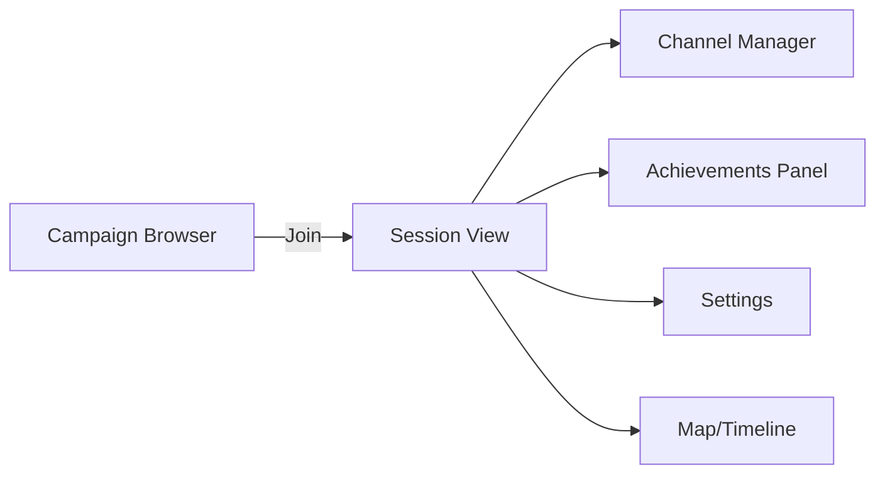
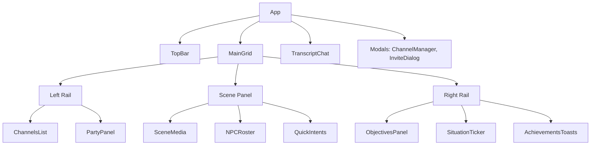

# UI Visual Design — Nation‑Building (reconciled from RPG)

## Design Goals
- Voice-first, readable at a glance, minimal friction
- Fast comprehension: clear focus panel, concise HUD, high-contrast captions
- Scalable layout for 1280×800 up to ultrawide; responsive to 1024×640
- Consistent art style (scene/portrait/item) with unobtrusive chrome
- Accessible: keyboardable, captions, ARIA roles, color-contrast compliant

## Nation‑Building Reconciliation & Migration Map

RPG primitives are reinterpreted as governance surfaces, preserving fast, voice‑first interaction and encounter‑style beats.

- Scene → Briefing/Press/Map focus panel
- NPC Roster → Cabinet/Advisors/Reporters list
- Objectives → Policy Agenda, Bills Pipeline, KPIs Alerts
- Encounters/Missions → Events/Initiatives with steps and outcomes
- Inventory/Artifacts → Resources/Budget/Entitlements
- Transcript/Chat → Captions/Logs for Cabinet/Press/Stage sessions

New Core Screens (Nation mode)
- Dashboard HUD (Economy/Population/Trade/Military/Science panels, alerts)
- Policy Console & Advisors (free‑form → capped modifiers)
- Legislature (bills list, stages, votes, veto/override)
- Press Conferences (reporter queue, Q&A transcript, live indicators)
- Cabinet Meetings (voice, actions, outcomes history)
- Trade & FX (prices, routes, contracts, FX baskets)
- Analytics (inflation, FX, trends, explainability)
- Leader Profile & Reign Summary (KPIs, narrative, leaderboard link)

Test IDs (global)
- `data-testid="mode-toggle-nation|hero"`
- `data-testid="panel-economy|population|trade|military|science|infrastructure"`
- `data-testid="alerts-panel"`

## Information Architecture (Session View)
- Primary focus: Scene (image/video + short narration)
- Secondary: Objectives HUD, Channel/Party, Transcript, Achievements toasts
- Utility: Map/Timeline notes (CRDT), Inventory/Artifacts, Settings

## Global Layout (Desktop, default)
```
┌─────────────────────────── Top Bar ───────────────────────────┐
│  Campaign ▼   Mission: Echoes of the Dyson Gate   Clock 19:45 │
│  Providers: OpenAI | Ollama   Voice: PTT [Space]   Settings ⚙ │
└───────────────────────────────────────────────────────────────┘
┌──────── Left Rail ────────┬──────────── Scene Panel ───────────┬──── Right Rail ────┐
│ Channels                   │  [Scene Image/Video 1024×576]     │ Objectives         │
│ - Global (muted)           │  Caption: "Ion storm flashes..."   │ - Reach Gate       │
│ - Party (live) ●           │------------------------------------│ - Scan emissions   │
│ - Alliance (idle)          │  NPC Roster (portraits)            │ - Parley Envoy     │
│ - Ad-hoc: Ops-brief (inv)  │  Quick Intents: [Scan] [Parley]…   │ Twists / Status    │
│ + New channel              │                                    │ Situation Ticker   │
│                             │                                    │ "Update: …"        │
│ Party/Alliances            │                                    │ Achievements Toasts│
│  • You (PTT)  • Kael       │                                    │ (stack, auto-hide) │
│  • Nysa  • Rho             │                                    │                     │
└────────────────────────────┴────────────────────────────────────┴─────────────────────┘
┌──────────────────────── Transcript / Chat / Logbook ─────────────────────────┐
│ [You] "We angle toward the Gate and run a low-power scan."                   │
│ [GM]  (d20+Int+Hacking=18 vs DC15) Success. Emissions resolve to...           │
│ [NPC Envoy] "We can help, for a price."                                      │
│                                                                                │
│  [Mic ◉] [Send]  (Push-to-talk / VAD)   Attach: Item/Clip   Channel: Party ▼  │
└───────────────────────────────────────────────────────────────────────────────┘
```

Notes
- Left Rail: Channels list + Party/Alliances quick panel; ad-hoc invites appear with badge
- Scene Panel: hero media, single-line caption, NPC roster, quick intents
- Right Rail: Objectives with progress, twists/states, situation ticker, achievements toasts stack
- Bottom: unified transcript/chat/logbook with channel selector

## Key Screens

### A. Lobby / Campaign Browser
```
┌ Campaigns ────────────────────────────┐   ┌ Schedule (selected) ────────────┐
│ + New Campaign [preset: Depth]        │   │ Next: Fri 7pm (2h), RRULE: Wkly │
│ • Orion Arm Frontier (Active)         │   │ Invites sent to 4 members        │
│ • Verdant Nebula (Archived)           │   │ [Join when ready]                │
└───────────────────────────────────────┘   └──────────────────────────────────┘
```

### B. Channel Manager (Modal)
```
┌ New Channel ────────────────────────────────┐
│ Name: Ops-brief                             │
│ Type: Voice + Text   Invite-only: [x]       │
│ Invite: [Kael] [Nysa] [Rho]                 │
│ Roles: Owner (You), Mods: [Kael]            │
│ [Create] [Cancel]                            │
└──────────────────────────────────────────────┘
```

### C. Achievements Panel
```
┌ Achievements (Player | Crew)  [All | Unlocked | Locked]  Category: All ┐
│ [Icon] First Steps    Common   1/1   Reward: 100 XP       [Unlocked]   │
│ [Icon] Skillful       Rare     6/10  Reward: Title        [Progress →] │
│ [Icon] Relic Hunter   Epic     2/3   Reward: Item         [Locked]     │
└─────────────────────────────────────────────────────────────────────────┘
```

### D. Settings (Preset)
```
┌ Preset: Subscription/Depth (Default) ───────────────────────────┐
│ Points visibility: Private (i)                                   │
│ Leaderboards: Off (switch to Competitive to enable)              │
│ Fail-forward strictness: Strict  (Strict | Lenient | Off)        │
│ Providers:  LLM [OpenAI▼]  Alt [Ollama▼]  STT [Whisper▼]         │
└──────────────────────────────────────────────────────────────────┘
```

### E. Campaign Setup (Resolution & Revial Options)
```
┌ New Campaign Setup ──────────────────────────────────────────────────┐
│ Name: [____________________]                                         │
│ World/Mission Pack: [Orion Arm Frontier ▼]                           │
│ Resolution Mode:  (•) Outcome Meter   ( ) Classic d20                │
│ Game Modes:   [ ] Hero (Encounters)   [ ] Nation (Governance)        │
│  ⓘ You can enable both; HUD toggles are available during play         │
│ Revial Options:   (•) Standard  ( ) Story/Casual  ( ) Hardcore       │
│  ⓘ Standard: clone/backup with minor costs; Story: limited rewinds;  │
│     Hardcore: permadeath                                             │
│ [Create] [Cancel]                                                    │
└──────────────────────────────────────────────────────────────────────┘
```

Test IDs:
- `data-testid="setup-name"`
- `data-testid="setup-pack"`
- `data-testid="setup-resolution-outcome"`
- `data-testid="setup-resolution-classic"`
- `data-testid="setup-mode-hero"`
- `data-testid="setup-mode-nation"`
- `data-testid="setup-mode-both"`
- `data-testid="setup-revial-standard|story|hardcore"`
- `data-testid="setup-submit"`

### F. Death Clock HUD
```
┌ Death Clock ───────────────────────┐   Momentum: 3  [Spend]          
│ ████████░░  12s                    │   Actions: [Stabilize] [Extract]
│ Status: Downed (Bleeding)          │   Costs:   +1 supply, -1 edge   
└────────────────────────────────────┘                                  
```

- Shows remaining time, status effects, and available actions (stabilize/extract/boost) with costs.
- Compatible with Outcome Meter: spending momentum previews band shift and pauses clock.
- Hardcore confirmation prompts before lethal outcomes.

Test IDs:
- `data-testid="death-clock"`
- `data-testid="death-clock-time"`
- `data-testid="death-clock-actions"`
- `data-testid="hardcore-confirm"`

## Component Inventory
- TopBar: campaign selector, mission title, provider indicators, PTT status, settings
- ChannelsList: channels, statuses, invite badges, new channel button
- PartyPanel: members with PTT status and health/status icons
- SceneMedia: image/video with caption; loading placeholder with shimmer; error fallback
- NPCRoster: small portraits with tooltips and quick “talk to” intent
- QuickIntentsBar: per-context macros (configurable)
- ObjectivesPanel: objective list with progress, twists, situation ticker card
- AchievementsToasts: queue manager with batching and aria-live announcements
- TranscriptChat: mixed transcript, channel selector, mic/send controls, attachments
- MapTimelinePanel: CRDT notes pins and timeline events
- Modal: ChannelManager, InviteDialog, ShareDialog
 - VictoryDashboard: weighted objectives progress, timer countdown, criteria details
 - LeaderboardPanel: campaign alliances and individuals boards; filters (scope, timeframe, region), pagination, search
 - GlobalLeaderboardView: opt-in global users board with privacy notice and filters
 - AlienCompendium: species catalog (non-humanoid emphasis) with portraits and morphology/physiology tags

### Outcome Meter HUD (Optional Classic Mode)
- Bands: Fail | Complication | Success | Critical Success; color-coded with accessible contrasts.
- Chance Bar: horizontal bar with live percent and modifier pills; shows expected cost if Complication triggered.
- Modifiers List: collapsible list detailing sources (skill, attribute, gear, status, clocks, momentum).
- Momentum/Edge: visible current value with [+]/Spend controls; spending previews band shift.
- Risk Preview: before commit, shows consequence tiers; updates as Momentum is toggled.
- Classic Toggle: switches to visible d20 and modifiers; persists per campaign/session.

Interaction & Accessibility
- Keyboard: open Outcome Meter (Alt+O), toggle Classic (Alt+C), spend Momentum (Alt+M).
- Screen readers: announce current band, chance, and expected costs; modifier pills have tooltips and aria labels.

Test IDs (Playwright)
- `data-testid="outcome-meter"`
- `data-testid="outcome-band-fail|complication|success|critical"`
- `data-testid="outcome-chance-bar"`
- `data-testid="outcome-modifiers"`
- `data-testid="momentum-controls"`
- `data-testid="classic-toggle"`

## States & Edge Cases
- Loading: skeletons for media/panels; spinner for provider calls; channel states optimistic
- Empty: friendly copy for no objectives/achievements yet; CTA to start a mission
- Error: inline error with retry; provider banner when model key missing
- Voice: PTT pressed state, VAD active meter; per-channel mute; global channel muted by default
- Accessibility: captions always available; keyboard shortcuts (PTT=Space, Switch Channel=Ctrl+Tab)

## Theming & Tokens
- Base: Tailwind (or CSS vars) with theme tokens: `--bg`, `--panel`, `--muted`, `--accent`, `--success`, `--warning`, `--danger`
- Shadows subtle; rounded md; 8px spacing grid
- Dark theme default; light theme optional

## Test IDs (Playwright)
- Scene media: `data-testid="scene-media"`
- Caption: `data-testid="scene-caption"`
- Objectives: `data-testid="mission-objectives"`
- Situation ticker: `data-testid="situation-ticker"`
- Channels list: `data-testid="channels-list"`
- New channel button: `data-testid="new-channel-btn"`
- Invite dialog: `data-testid="invite-dialog"`
- Achievements panel: `data-testid="achievements-panel"`
- Unlock toast: `data-testid="unlock-toast"`
- Transcript input: `data-testid="transcript-input"`
- PTT button: `data-testid="ptt-button"`

## Open Questions
- Do we prefer left or right placement for Map/Timeline by default?
- Should global channel auto-join with listen-only? (Current: muted by default.)
- What is the acceptable max height for transcript before compact mode engages?

---

## Page Flow (Mermaid)



## Component Hierarchy (Mermaid)



## Mobile/Small View (compact)
- Collapse rails into drawers (left=Channels/Party, right=Objectives)
- Scene as primary; transcript as swipe-up bottom sheet
- Floating mic button; quick intents as pill row over media

## Full HUD Design (MVP + Empire Mode)

### Controls Row (Top of HUD)
- Game Mode selector: Hero | Empire
- Resolution Mode selector: Outcome | Classic
- Save Settings button

Test IDs
- `data-testid="hud-game-mode"`
- `data-testid="hud-resolution-mode"`
- `data-testid="hud-save-settings"`

### Encounter Clock & Outcome Preview
- Encounter Tick button advances an encounter clock bar (simulated in MVP)
- Outcome Preview button queries `/api/outcome/preview` and fills a success bar with %

Test IDs
- `data-testid="hud-encounter-tick"`
- `data-testid="hud-encounter-clock"`
- `data-testid="hud-outcome-preview"`
- `data-testid="hud-outcome-success"`

### Panels Grid
- Backpack
  - Simple list for quick items; expand to Inventory in future
- Credits & Resources
  - Shows Credits, Alloys, Fuel (MVP); drill-down planned
- Map / Planet
  - Current planet/system, sector context
- Empire Summary
  - Name, holdings, fleets count (MVP)
- Backstory & History
  - Textarea; save persists to `/api/settings`
- Alien Civilizations — Diverse Personalities
  - List of species/personality examples; links to compendium later
- Vezy Score
  - Goals + current score; 4 bars: Story, Empire, Discovery, Social
  - Demo buttons increment score via `/api/vezy/event`
- Planet/Civilization Generator (Hero/Setup Utility)
  - Generates random planet JSON via `/api/generator/planet`
- Empire — Planets & Production
  - Create Planet (POST `/api/empire/planets`)
  - Production Tick (POST `/api/empire/planets/:id/tick`)
  - Lists Planets, Production preview, Stockpiles
  - Build Queue: Add Demo Build (POST `/api/empire/planets/:id/queues`), Work Tick (POST `/api/empire/queues/:queueId/tick`), progress bar
  - Units: Train Infantry (POST `/api/empire/planets/:id/units/infantry`), list units

### Nation Mode Panels (New)

Press Conferences
- Layout: Left (Reporter Queue), Center (Q&A Transcript), Right (Indicators & Effects)
- Controls: Start/End, Select Question, Answer field (voice/NL), Publish
- Live: WS badges for speaking, queue changes
- Test IDs: `data-testid="press-queue"`, `data-testid="press-transcript"`, `data-testid="press-start|end"`, `data-testid="press-answer"`, `data-testid="press-live-indicator"`

Cabinet Meetings
- Layout: Roster with speaking dots, transcript with chapter markers, action items list
- Controls: Start/End, Summarize, Approve Actions
- Test IDs: `data-testid="cabinet-roster"`, `data-testid="cabinet-transcript"`, `data-testid="cabinet-actions"`

Policy Console & Advisors
- Left: Policy Draft editor; Right: Parsed effects (capped), Advisor proposals
- Actions: Submit for Review, Activate (if valid), Revert
- Test IDs: `data-testid="policy-editor"`, `data-testid="policy-effects"`, `data-testid="advisor-proposals"`

Legislature
- Bills table (stage chips), detail drawer (votes, thresholds, veto/override), advance controls
- Test IDs: `data-testid="bills-table"`, `data-testid="bill-detail"`, `data-testid="bill-advance"`

Trade & FX
- Tabs: Prices, Contracts, Routes, FX Baskets; right rail: indices and filters
- Test IDs: `data-testid="fx-baskets"`, `data-testid="prices-table"`, `data-testid="contracts-grid"`

Analytics (Inflation/FX)
- Charts with time window selector; trend deltas; explainability link
- Test IDs: `data-testid="analytics-inflation"`, `data-testid="analytics-fx"`, `data-testid="trend-window"`

Leader Profile & Reign Summary
- Cards: Tenure, GDPΔ, InflationAvg, ApprovalAvg, CrisesResolved, WarsWon, TreatiesSigned, ReformsPassed
- CTA: View Leaderboard
- Test IDs: `data-testid="reign-summary"`, `data-testid="leaderboard-link"`

Test IDs (mapping to demo ids)
- Backpack: `data-testid="hud-backpack"` (demo id `#backpack`)
- Credits: `data-testid="hud-credits"` (demo id `#credits`)
- Resources: `data-testid="hud-resources"` (demo ids `#alloys`, `#fuel`)
- Map/Planet: `data-testid="hud-planet"`
- Empire Summary: `data-testid="hud-empire"`
- Backstory: `data-testid="hud-backstory"`; Save: `data-testid="hud-backstory-save"`
- Alien Personalities: `data-testid="hud-aliens"`
- Vezy Goals: `data-testid="hud-vezy-goals"`; Score: `data-testid="hud-vezy-score"`
- Vezy Bars: `data-testid="hud-vezy-bar-story|empire|discovery|social"`
- Vezy Increment Buttons: `data-testid="hud-vezy-add-story|empire|discovery|social"`
- Planet Generator Button: `data-testid="hud-gen-planet"`; Output: `data-testid="hud-gen-planet-out"`
- Empire Create: `data-testid="hud-empire-create"` (demo id `#empireCreate`)
- Empire Tick: `data-testid="hud-empire-tick"` (demo id `#empireTick`)
- Empire Planets List: `data-testid="hud-empire-planets"` (demo id `#empirePlanets`)
- Production Preview: `data-testid="hud-empire-prod"` (demo id `#empireProd`)
- Stockpiles: `data-testid="hud-empire-stocks"` (demo id `#empireStocks`)
- Queue Add: `data-testid="hud-empire-queue-add"` (demo id `#queueAdd`)
- Queue Tick: `data-testid="hud-empire-queue-tick"` (demo id `#queueTick`)
- Queue Progress: `data-testid="hud-empire-queue-progress"` (demo id `#queueProg`)
- Queue JSON: `data-testid="hud-empire-queue"` (demo id `#empireQueue`)
- Units Train: `data-testid="hud-empire-units-train"` (demo id `#unitTrain`)
- Units List: `data-testid="hud-empire-units"` (demo id `#empireUnits`)

### HUD Analytics Screen (Empire)
- Panels: Economy (indices, budget sliders), Military (strength/readiness), Population (growth/morale), Science (velocity/breakthroughs), Infrastructure (uptime)
- Alerts panel: KPI threshold breaches (hysteresis), actions needed
- Controls: policies/taxes (authorized roles) via sliders/toggles; preview projected impact bands

Data Binding & API (planned)
- Latest Snapshot: `GET /api/analytics/empire?scope=campaign`
- Trends (window=N): `GET /api/analytics/trends?window=30`
- Policies: `POST /api/economy/policies`
- Taxes: `POST /api/economy/taxes`

Test IDs
- `data-testid="hud-analytics"`
- `data-testid="hud-analytics-economy|military|population|science|infrastructure"`
- `data-testid="hud-analytics-alerts"`
- `data-testid="hud-analytics-policy|taxes"`

### Accessibility & Keyboard
- Keyboard shortcuts (default)
  - PTT: Space (hold)
  - Switch Channel: Ctrl+Tab
  - Outcome Meter: Alt+O
  - Toggle Classic: Alt+C
  - Spend Momentum: Alt+M
  - Focus Transcript: Alt+T
- ARIA & Labels
  - All interactive controls labeled; progress bars have `aria-valuenow/min/max`
  - Live regions for achievements toasts and situation ticker

### Visual Consistency & Themes
- Use style tokens from Theming & Tokens
- Scene/portrait/item art uses consistent style profiles; HUD chrome remains minimal
