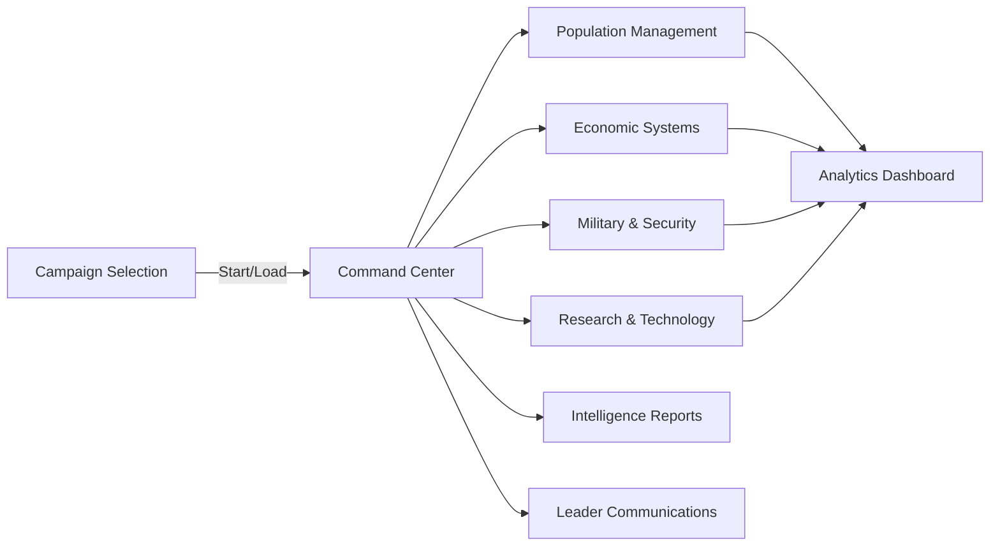
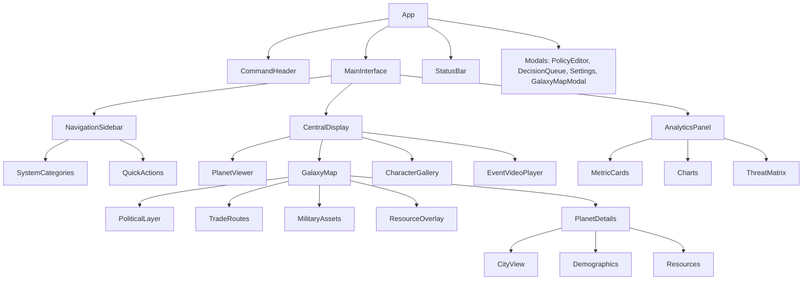

# Startales UI Visual Design - Civilization Management Interface

## Design Goals
- **Immersive Command Center**: Futuristic sci-fi interface for civilization management
- **Data-Rich Environment**: Comprehensive analytics and real-time visualizations
- **PC-First Optimization**: Designed for 1920×1080+ displays with ultrawide and 4K support
- **AI-Enhanced Visuals**: Generated planets, characters, species, and event content
- **Cinematic Experience**: Smooth animations, dramatic lighting, holographic effects
- **Accessible**: Full keyboard navigation, screen reader support, high contrast modes

## Information Architecture (Civilization Management)
- **Primary Focus**: Central planet/civilization display with AI-generated visuals
- **Secondary Systems**: Analytics panels, population metrics, economic indicators
- **Tertiary Controls**: Quick actions, notifications, system status indicators
- **Real-Time Data**: Live updates via WebSocket, 120-second tick cycle

## Core Interface Principles
- **Command Center Layout**: Central display surrounded by specialized control panels
- **Contextual Information**: System-specific data displayed based on current focus
- **Hierarchical Navigation**: Drill-down from overview to detailed system management
- **Real-Time Feedback**: Immediate visual response to player actions and system changes

## Key Interface Screens

### A. Campaign Selection & Setup
```
┌─────────────────── Campaign Management ───────────────────┐
│ 🌍 New Civilization                                       │
│ ├─ Species: [Human] [Alien] [Custom]                      │
│ ├─ Starting Era: [Modern] [Space Age] [Post-Scarcity]    │
│ ├─ Planet Type: [Terrestrial] [Ocean] [Desert] [Ice]     │
│ ├─ Difficulty: [Peaceful] [Normal] [Challenging] [Brutal] │
│ └─ Victory: [Economic] [Military] [Diplomatic] [Science]  │
│                                                           │
│ 📁 Existing Campaigns                                     │
│ • Terra Nova Federation (Active - Tick 1,247)            │
│ • Martian Republic (Paused - Tick 892)                   │
│ • Alpha Centauri Colony (Completed - Victory: Science)   │
│                                                           │
│ [🚀 Start New Campaign] [📁 Load Campaign] [⚙️ Settings]  │
└───────────────────────────────────────────────────────────┘
```

### B. Enhanced Main Command Dashboard - All Systems Integrated
```
┌─────────────────────── Command Header (140px) ──────────────────────────┐
│ 🌌 STARTALES COMMAND CENTER    🎯 Terra Nova Federation    ⏰ 2387.156.14:23 │
│ 👤 President Sarah Chen | 📊 Approval: 67% ↗️ | 💰 Treasury: 2.4T ₵ | 🔔 12 │
│ 🎯 Active: Colonial Expansion | 📈 GDP: +2.1% | 🛡️ Threat: LOW | ⚡ 98% │
└─────────────────────────────────────────────────────────────────────────┘
┌─ Left Panel (320px) ─┬────────── Central Display (1280×720) ──────────┬─ Right Panel (320px) ─┐
│ 🎮 QUICK COMMANDS     │ ┌─ Primary View ─────────────────────────────┐ │ 📊 LIVE METRICS       │
│ ├─ 🚨 Crisis Center   │ │         🌍 TERRA NOVA                     │ │ Population: 340M      │
│ ├─ 📋 Daily Briefing  │ │    [AI-Generated Planet View]             │ │ ━━━━━━━━━━ +0.8%      │
│ ├─ 🎤 Address Nation  │ │  Cities: 47  |  Happiness: 72%           │ │ GDP Growth: +2.1%     │
│ └─ ⚖️ Emergency Powers │ │  Security: 87% | Development: Advanced    │ │ ━━━━━━━━━━ ↗️         │
│                       │ └───────────────────────────────────────────┘ │ Security: 87%         │
│ 🏛️ GOVERNMENT         │ ┌─ System Tabs ─────────────────────────────┐ │ ━━━━━━━━━━ ↗️         │
│ ├─ 🏛️ Cabinet         │ │[Gov][Econ][Pop][Mil][Sci][Comm][Intel]   │ │ Active Threats: 2     │
│ ├─ ⚖️ Policies        │ └───────────────────────────────────────────┘ │ • Pirate Activity     │
│ ├─ 🏛️ Legislature     │ ┌─ Active System Display ───────────────────┐ │ • Trade Dispute       │
│ ├─ ⚖️ Supreme Court   │ │ [Context-Sensitive System Interface]      │ │                       │
│ ├─ 🎭 Political       │ │ [Charts, Controls, Data Tables]          │ │ 🎯 OBJECTIVES         │
│ └─ 🤝 Delegation      │ │ [Real-time Analytics & Management]       │ │ ├─ Reduce unemployment │
│                       │ └───────────────────────────────────────────┘ │ ├─ Improve relations   │
│ 💰 ECONOMY            │                                               │ ├─ Complete fusion     │
│ ├─ 💰 Treasury        │                                               │ └─ Address climate     │
│ ├─ 📈 Trade           │                                               │                       │
│ ├─ 🏢 Business        │                                               │ 📈 QUICK STATS        │
│ ├─ 🏦 Central Bank    │                                               │ Military: 890K        │
│ ├─ 📊 Markets         │                                               │ Scientists: 2.1M      │
│ └─ 💸 Inflation       │                                               │ Unemployed: 14M       │
│                       │                                               │ Cities: 47            │
│ 👥 POPULATION         │                                               │ Trade Routes: 23      │
│ ├─ 👥 Demographics    │                                               │ Research Projects: 8  │
│ ├─ 🏙️ Cities          │                                               │                       │
│ ├─ 🚶 Migration       │                                               │ 🔔 ALERTS             │
│ └─ 💼 Professions     │                                               │ ├─ 🚨 3 Urgent         │
│                       │                                               │ ├─ ⚠️ 7 Important      │
│ 🛡️ SECURITY           │                                               │ └─ ℹ️ 2 Info          │
│ ├─ 🛡️ Military        │                                               │ [View All Alerts]     │
│ ├─ 🏰 Defense         │                                               │                       │
│ ├─ 🔒 Security        │                                               │                       │
│ ├─ ⭐ Joint Chiefs    │                                               │                       │
│ └─ 🕵️ Intelligence    │                                               │                       │
│                       │                                               │                       │
│ 🔬 SCIENCE            │                                               │                       │
│ ├─ 🔬 Technology      │                                               │                       │
│ ├─ 🧪 Research        │                                               │                       │
│ ├─ 🎮 Simulation      │                                               │                       │
│ └─ 🎨 Visual          │                                               │                       │
│                       │                                               │                       │
│ 📡 COMMUNICATIONS     │                                               │                       │
│ ├─ 📡 Comm Hub        │                                               │                       │
│ ├─ 📰 News            │                                               │                       │
│ ├─ 🎤 Speeches        │                                               │                       │
│ ├─ 📊 Approval        │                                               │                       │
│ └─ 🎯 Policy Advisor  │                                               │                       │
│                       │                                               │                       │
│ ⚙️ ADMINISTRATION     │                                               │                       │
│ ├─ 🎮 Campaign        │                                               │                       │
│ ├─ 📋 Legal           │                                               │                       │
│ ├─ 🏠 Interior        │                                               │                       │
│ ├─ 💼 Commerce        │                                               │                       │
│ └─ 🏛️ State          │                                               │                       │
└───────────────────────┴───────────────────────────────────────────────────┴───────────────────────┘
┌─────────────────────── Action Bar & Status (100px) ──────────────────────────┐
│ 🎤 [Address Nation] 📋 [Daily Brief] ⚔️ [Military] 🔬 [Research] 💰 [Budget]   │
│ ⏸️ Simulation: RUNNING | Tick: 1,247 | Speed: 2min/tick | Next: 00:47        │
│ 🌐 Network: ONLINE | 📊 Performance: 98% | 💾 Auto-Save: ON | 🔄 Sync: 00:12  │
└─────────────────────────────────────────────────────────────────────────────┘
```

### C. System Management Interface
```
┌─────────────────── Population Management ────────────────────┐
│ 📊 Demographics        👥 Citizens         🏠 Settlements     │
│ ├─ Total: 340M         ├─ Leaders: 1,247   ├─ Cities: 47     │
│ ├─ Growth: +0.8%       ├─ Scientists: 2.1M ├─ Towns: 156     │
│ ├─ Age 0-18: 22%       ├─ Military: 890K   ├─ Villages: 1.2K │
│ ├─ Age 19-65: 68%      ├─ Workers: 198M    └─ Outposts: 89   │
│ └─ Age 65+: 10%        └─ Unemployed: 14M                    │
│                                                              │
│ 🎯 Active Policies                                           │
│ • Universal Healthcare (Happiness +5%, Cost -$120B/year)    │
│ • Education Reform (Skills +10%, Implementation 67%)        │
│ • Immigration Incentives (Growth +0.3%, Integration 89%)    │
│                                                              │
│ [👥 Manage Citizens] [🏙️ City Planning] [📊 View Analytics] │
└──────────────────────────────────────────────────────────────┘
```

Test IDs:
- `data-testid="campaign-selector"`
- `data-testid="command-dashboard"`
- `data-testid="system-management"`
- `data-testid="population-panel"`
- `data-testid="economic-panel"`
- `data-testid="military-panel"`

## Core Component Library

### Layout Components
- **CommandHeader**: Campaign info, leader status, alerts, system time
- **NavigationSidebar**: System categories, quick actions, objectives panel
- **CentralDisplay**: AI-generated planet views, character galleries, event videos
- **AnalyticsPanel**: Real-time charts, metrics, performance indicators
- **StatusBar**: Simulation controls, tick counter, system health indicators

### Visualization Components
- **PlanetViewer**: AI-generated orbital/surface views with real-time overlays
- **GalaxyMap**: Interactive 3D/2D galaxy visualization with political boundaries, trade routes, and strategic overlays
- **CharacterGallery**: Dynamic portraits with status indicators and interactions
- **SpeciesCompendium**: Alien race catalog with behavioral animations
- **TechnologyTree**: Interactive research network with progress visualization
- **EventVideoPlayer**: Cinematic clips for major game events

### Data Display Components
- **MetricCard**: KPI displays with trend indicators and status colors
- **AnalyticsChart**: Futuristic charts with glow effects and animations
- **DataTable**: System entity management with CRUD operations
- **ProgressIndicator**: Research, construction, and policy implementation progress
- **ThreatMatrix**: Multi-dimensional security and risk assessment display

### Control Components
- **PolicyEditor**: Natural language policy creation with AI assistance
- **DecisionQueue**: Pending decisions with urgency and impact analysis
- **CommunicationCenter**: Leader briefings, speeches, and public addresses
- **SimulationControls**: Tick speed, pause/resume, scenario management
- **AlertCenter**: System notifications with priority and action buttons

### Interaction & Accessibility Standards
- **Keyboard Navigation**: Full keyboard support with logical tab order
- **Screen Reader Support**: ARIA labels and live regions for dynamic content
- **Real-Time Updates**: Announce system changes and alerts to assistive technology
- **High Contrast Mode**: Alternative color schemes for visual accessibility
- **Motion Reduction**: Respect for prefers-reduced-motion settings

### Test IDs (Playwright)
- `data-testid="command-center"`
- `data-testid="planet-viewer"`
- `data-testid="analytics-panel"`
- `data-testid="character-gallery"`
- `data-testid="policy-editor"`
- `data-testid="decision-queue"`

## System States & Edge Cases
- **Loading States**: Skeleton screens for analytics panels, shimmer effects for AI-generated content
- **Empty States**: Friendly guidance for new campaigns, clear CTAs for system initialization
- **Error Handling**: Inline error messages with retry options, fallback content for failed AI generation
- **Real-Time Connectivity**: Connection status indicators, graceful degradation for offline mode
- **Performance Optimization**: Lazy loading for complex visualizations, progressive enhancement

## Design System Foundation
- **Base Framework**: Tailwind CSS with custom futuristic theme tokens
- **Color System**: Cyan/blue primary, orange secondary, matrix green success, space-dark backgrounds
- **Typography**: Orbitron display font, Rajdhani UI font, Share Tech Mono for data
- **Spacing**: 8px base unit system with consistent grid alignment
- **Effects**: Glow shadows, holographic panels, animated borders, particle backgrounds
- **Theme**: Dark space theme primary, high contrast mode available

## Comprehensive Test IDs (Playwright)
- **Main Interface**: `data-testid="command-center-main"`
- **Planet Display**: `data-testid="planet-viewer-central"`
- **Galaxy Map**: `data-testid="galaxy-map-interactive"`
- **Analytics**: `data-testid="analytics-dashboard"`
- **Population**: `data-testid="population-management"`
- **Economy**: `data-testid="economic-systems"`
- **Military**: `data-testid="security-defense"`
- **Research**: `data-testid="technology-research"`
- **Communications**: `data-testid="leader-communications"`
- **Intelligence**: `data-testid="intelligence-reports"`
- **Simulation**: `data-testid="simulation-controls"`

### Galaxy Map Specific Test IDs
- **Map Container**: `data-testid="galaxy-map-container"`
- **Zoom Controls**: `data-testid="galaxy-zoom-controls"`
- **View Mode Toggle**: `data-testid="galaxy-view-mode"`
- **Political Overlay**: `data-testid="galaxy-political-layer"`
- **Trade Routes**: `data-testid="galaxy-trade-routes"`
- **Military Assets**: `data-testid="galaxy-military-layer"`
- **Planet Tooltip**: `data-testid="planet-tooltip"`
- **System Details**: `data-testid="system-detail-panel"`
- **Planet Drill-Down**: `data-testid="planet-detail-view"`
- **City View**: `data-testid="city-detail-panel"`

## Design Considerations
- **Multi-Monitor Layout**: How should panels distribute across multiple displays?
- **Real-Time Performance**: What's the optimal balance between visual fidelity and performance?
- **AI Content Caching**: How long should generated visuals be cached before regeneration?
- **Analytics Depth**: What level of drill-down detail is most useful for each system?
- **Notification Priority**: How should urgent alerts be distinguished from routine updates?

---

## Application Flow (Mermaid)



## Component Architecture (Mermaid)



## Responsive Design (PC-First)
- **Primary Target**: 1920×1080+ desktop displays with full feature set
- **Ultrawide Support**: 2560×1440+ with expanded analytics panels
- **4K Optimization**: Scaled interface elements for 3840×2160+ displays
- **Minimum Viable**: 1366×768 laptop with collapsed sidebar and simplified charts
- **Tablet Fallback**: 1024×768+ with drawer navigation and touch-optimized controls

## Command Center Interface Architecture

### Header Controls
- **Campaign Selector**: Active civilization and campaign management
- **System Status**: Real-time health indicators for all major systems
- **Leader Profile**: Current leader avatar, approval rating, key metrics
- **Alert Center**: Priority notifications and urgent decision queue
- **Simulation Controls**: Tick speed, pause/resume, time display

### Central Command Display
- **Primary View**: AI-generated planet visualization with real-time overlays
- **Secondary Panels**: Rotating analytics displays (population, economy, military)
- **Interactive Elements**: Clickable regions, zoom controls, view mode toggles
- **Status Overlays**: City lights, weather patterns, traffic flows, development indicators

### System Management Panels
- **Population Dashboard**
  - Demographics overview with AI-generated citizen portraits
  - Growth trends, happiness indices, skill distributions
  - Migration flows and settlement management
- **Economic Control Center**
  - GDP tracking, trade flows, market confidence indicators
  - Business sector health, employment statistics
  - Resource management and budget allocation
- **Military Command**
  - Force readiness, threat assessments, conflict history
  - Intelligence networks, defense spending analysis
  - Security incident tracking and response protocols
- **Research Laboratory**
  - Technology tree visualization with interactive nodes
  - Innovation rates, research efficiency metrics
  - Breakthrough predictions and collaboration networks
- **Diplomatic Relations**
  - Species gallery with AI-generated alien portraits
  - Relationship matrices, treaty status, communication logs
  - Cultural exchange programs and diplomatic initiatives

### Interactive Galaxy Map System
- **Strategic Overview**
  - 3D galaxy visualization with seamless zoom from galactic to planetary scale
  - Political boundary overlays with civilization territories and contested zones
  - Real-time updates showing fleet movements, trade routes, and conflict zones
  - Multiple view modes: Political, Economic, Military, Diplomatic, Resource, Environmental
- **Interactive Features**
  - Hover tooltips with comprehensive system/planet summary information
  - Click-to-drill-down navigation: Galaxy → Sector → System → Planet → Cities → Districts
  - Multi-select capabilities for bulk operations and comparative analysis
  - Bookmarking system and custom view saves for strategic planning
  - Time-lapse mode to visualize historical changes and predict future trends
- **Visual Layers & Overlays**
  - Political boundaries with civilization colors and influence gradient zones
  - Trade route visualization with animated flow indicators showing volume and value
  - Military presence markers (fleets, bases, patrol routes, defensive installations)
  - Resource distribution heat maps highlighting strategic materials and scarcity zones
  - Diplomatic relationship indicators (alliances, tensions, neutral zones, embargo areas)
  - Environmental data (habitability, climate, natural disasters, terraforming progress)
- **Planet Detail Drill-Down**
  - **Demographics Panel**: Population breakdown, growth trends, species composition, migration patterns
  - **Resource Overview**: Mineral deposits, energy production, agricultural output, strategic reserves
  - **Military Assessment**: Defensive installations, garrison strength, fleet presence, threat level
  - **Economic Profile**: Industrial capacity, trade hub status, GDP contribution, employment sectors
  - **Infrastructure Status**: Transportation networks, communication systems, development level
  - **Environmental Conditions**: Habitability rating, climate data, terraforming status, natural hazards
- **City-Level Detail**
  - Urban planning layouts with district specializations (residential, industrial, commercial, military)
  - Population density heat maps and demographic distribution
  - Infrastructure health indicators (power, water, transportation, communications)
  - Economic activity centers and trade flow visualization
  - Security installations and emergency response capabilities

---


---

## Futuristic Command Center Interface - Final Design

### Design Philosophy

#### **Command Center Aesthetic**
- **Sci-Fi Command Bridge**: Inspired by Star Trek bridge, Mass Effect Normandy, and Stellaris interface
- **Holographic Elements**: Glowing borders, translucent panels, particle effects
- **Data-Rich Environment**: Multiple screens, extensive analytics, real-time visualizations
- **Cinematic Experience**: Smooth animations, dramatic lighting, immersive atmosphere
- **PC-First Optimization**: Designed for 1920×1080+ displays with ultrawide and 4K support

#### **Visual Hierarchy**
- **Primary Focus**: Large central display with AI-generated planet/character visualizations
- **Secondary Displays**: Surrounding analytics panels with live charts and metrics
- **Tertiary Info**: Status bars, notifications, and quick access controls
- **Ambient Elements**: Background animations, particle systems, atmospheric effects

### Main Command Interface Layout (PC-First: 1920×1080+)

```
┌─────────────────────── Command Header (120px) ──────────────────────────┐
│ 🌌 STARTALES COMMAND CENTER    🎯 Campaign: New Terra    ⏰ Stardate 2387.4 │
│ 👤 Leader Avatar | 📊 Approval: 67% | 💰 Treasury: 2.4T Credits | 🔔 Alerts │
└─────────────────────────────────────────────────────────────────────────┘
┌─ Left Panel ─┬────────────── Central Display (1200×800) ──────────────┬─ Right Panel ─┐
│ 🎮 Quick Cmd  │ ┌─ Primary View ─────────────────────────────────────┐ │ 📊 Live Metrics│
│ 🌍 Planets    │ │                                                   │ │ Population:    │
│ 🏛️ Government │ │         🌍 PLANET TERRA NOVA                      │ │ 340M (+0.8%)   │
│ 💰 Economy    │ │    [AI-Generated Planet Visualization]            │ │ ━━━━━━━━━━     │
│ 👥 Population │ │                                                   │ │                │
│ 🛡️ Military   │ │  Cities: 47  |  Population: 340M                 │ │ GDP Growth:    │
│ 🔬 Research   │ │  Happiness: 72% | Security: 87%                   │ │ +2.1% ↗️       │
│ 🌌 Diplomacy  │ │                                                   │ │ ━━━━━━━━━━     │
│ 📰 Intel      │ │ [Real-time city lights, weather, traffic]        │ │                │
│ 🎬 Media      │ └───────────────────────────────────────────────────┘ │ Threats:       │
│               │ ┌─ Secondary Displays ──────────────────────────────┐ │ 2 Active ⚠️    │
│ 🎯 Objectives │ │ [Economic Chart] [Population Graph] [Tech Tree]   │ │ ━━━━━━━━━━     │
│ ⚙️ Settings   │ └───────────────────────────────────────────────────┘ │                │
└───────────────┴─────────────────────────────────────────────────────────┴────────────────┘
┌─────────────────────── Action Bar & Status (80px) ──────────────────────────┐
│ 🎤 [Address Nation] 📋 [Daily Briefing] ⚔️ [Military Orders] 🔬 [Research]    │
│ ⏸️ Simulation: RUNNING | Tick: 1,247 | Speed: 2min/tick | Next: 00:47       │
└─────────────────────────────────────────────────────────────────────────────┘
```

### Interactive Galaxy Map Interface

#### **Full-Screen Galaxy Map Mode**
```
┌─────────────────────── Galaxy Map Interface ──────────────────────────┐
│ 🌌 Galaxy View | 🔍 Zoom: Sector Level | 👁️ Mode: Political | ⚙️ Layers │
├─────────────────────────────────────────────────────────────────────────┤
│ ┌─ View Controls ─┐ ┌─────── 3D Galaxy Display ──────────┐ ┌─ Details ─┐ │
│ │ 🔍 Zoom Levels  │ │                                    │ │ Selected:  │ │
│ │ • Galaxy        │ │        ⭐ Sol System               │ │ Sol System │ │
│ │ • Sector ●      │ │     🔴 Terra Nova                  │ │            │ │
│ │ • System        │ │                                    │ │ Population │ │
│ │ • Planet        │ │  🟡 Alpha Centauri                 │ │ 340M       │ │
│ │                 │ │     🔵 New Geneva                  │ │            │ │
│ │ 👁️ View Modes   │ │                                    │ │ Military   │ │
│ │ • Political ●   │ │        ⭐ Vega System              │ │ 12 Fleets  │ │
│ │ • Economic      │ │     🟢 Vega Prime                  │ │            │ │
│ │ • Military      │ │                                    │ │ Trade      │ │
│ │ • Diplomatic    │ │  ═══════════════════════════       │ │ 2.4T/year  │ │
│ │ • Resource      │ │  Political Boundary: Human Empire  │ │            │ │
│ │ • Environment   │ │  ═══════════════════════════       │ │ Threats    │ │
│ │                 │ │                                    │ │ None       │ │
│ │ 🎚️ Layers       │ │     ↗️ Trade Route (Active)        │ │            │ │
│ │ ☑️ Boundaries   │ │     ⚔️ Fleet Patrol Route          │ │ [Drill     │ │
│ │ ☑️ Trade Routes │ │                                    │ │  Down]     │ │
│ │ ☑️ Military     │ │  🔺 Alien Territory: Zephyrians   │ │            │ │
│ │ ☐ Resources     │ │     🔺 Hostile Border              │ │            │ │
│ │ ☐ Environment   │ └────────────────────────────────────┘ └────────────┘ │
│ └─────────────────┘                                                       │
├─────────────────────────────────────────────────────────────────────────┤
│ 🎯 Quick Actions: [📊 System Analysis] [🚀 Deploy Fleet] [💼 Trade Deal] │
└─────────────────────────────────────────────────────────────────────────┘
```

#### **Planet Detail Drill-Down Interface**
```
┌─────────────────── Planet Detail View: Terra Nova ───────────────────┐
│ ← Back to Galaxy | 🌍 Terra Nova | 👥 340M Population | 🛡️ Secure     │
├───────────────────────────────────────────────────────────────────────┤
│ ┌─ Planet View ─┐ ┌─── Demographics ────┐ ┌─── Military ─────┐       │
│ │               │ │ Total: 340M         │ │ Garrison: 2.1M   │       │
│ │   🌍 Terra    │ │ Growth: +0.8%       │ │ Fleets: 3 Active │       │
│ │    Nova       │ │ Happiness: 72%      │ │ Bases: 12 Major  │       │
│ │  [AI Planet   │ │ Species Mix:        │ │ Defense: 87%     │       │
│ │   Image]      │ │ • Human: 89%        │ │ Threat Level: Low│       │
│ │               │ │ • Alien: 11%        │ └──────────────────┘       │
│ │ Climate: Temp │ │ Age Distribution:   │ ┌─── Economy ──────┐       │
│ │ Gravity: 1.0g │ │ • 0-18: 22%        │ │ GDP: $8.2T       │       │
│ │ Atmosphere: O2│ │ • 19-65: 68%       │ │ Growth: +2.1%    │       │
│ └───────────────┘ │ • 65+: 10%         │ │ Unemployment: 4% │       │
│                   └────────────────────┘ │ Trade: $1.2T/yr  │       │
│ ┌─────────────── City Overview ──────────────────────────────┐       │
│ │ 🏙️ Major Cities (47 total)                                │       │
│ │ • New Geneva (Capital) - 45M pop - Government/Finance     │       │
│ │ • Port Victoria - 28M pop - Trade Hub/Manufacturing      │       │
│ │ • Tech Valley - 19M pop - Research/Innovation            │       │
│ │ • Fort Armstrong - 12M pop - Military/Defense            │       │
│ │ [View All Cities] [City Planning] [Infrastructure]       │       │
│ │ └─────────────────────────────────────────────────────────┘       │
├───────────────────────────────────────────────────────────────────────┤
│ 🎯 Actions: [👥 Manage Population] [🏭 Industry] [🛡️ Defense] [🏙️ Cities] │
└───────────────────────────────────────────────────────────────────────┘
```

#### **City-Level Detail Interface**
```
┌─────────────────── City View: New Geneva ────────────────────────────┐
│ ← Terra Nova | 🏙️ New Geneva | Capital City | 👥 45M Population      │
├───────────────────────────────────────────────────────────────────────┤
│ ┌─ City Layout ──┐ ┌─── Districts ────────┐ ┌─── Infrastructure ───┐ │
│ │ [3D City View] │ │ 🏛️ Government: 12%   │ │ ⚡ Power: 98%        │ │
│ │               │ │ 🏠 Residential: 45%  │ │ 💧 Water: 95%        │ │
│ │  🏛️ Capitol   │ │ 🏭 Industrial: 18%   │ │ 🚇 Transport: 92%    │ │
│ │    Complex    │ │ 🏪 Commercial: 15%   │ │ 📡 Comms: 99%        │ │
│ │               │ │ 🎓 Education: 6%     │ │ 🗑️ Waste: 89%        │ │
│ │  🏭 Industrial│ │ 🏥 Healthcare: 4%    │ │ 🛡️ Security: 94%     │ │
│ │     Quarter   │ └──────────────────────┘ └──────────────────────┘ │
│ │               │ ┌─── Population ───────┐ ┌─── Economy ──────────┐ │
│ │  🏠 Residential│ │ Density: High        │ │ GDP: $2.1T          │ │
│ │     Sectors   │ │ Growth: +1.2%        │ │ Employment: 96%     │ │
│ └───────────────┘ │ Satisfaction: 74%    │ │ Avg Income: $67K    │ │
│                   │ Education: 89%       │ │ Cost of Living: Med │ │
│                   └──────────────────────┘ └──────────────────────┘ │
├───────────────────────────────────────────────────────────────────────┤
│ 🎯 City Management: [🏗️ Construction] [👥 Services] [🚇 Transport] [📊 Analytics] │
└───────────────────────────────────────────────────────────────────────┘
```

### Futuristic Color Palette

```css
/* Primary - Cyan/Blue Tech */
--primary-glow: #00d9ff;
--primary-bright: #0099cc;
--primary-dark: #004d66;
--primary-shadow: rgba(0, 217, 255, 0.3);

/* Secondary - Orange/Amber Energy */
--secondary-glow: #ff9500;
--secondary-bright: #cc7700;
--secondary-dark: #663c00;
--secondary-shadow: rgba(255, 149, 0, 0.3);

/* Success - Green Matrix */
--success-glow: #00ff88;
--success-bright: #00cc66;
--success-dark: #004d26;

/* Warning - Yellow Alert */
--warning-glow: #ffdd00;
--warning-bright: #ccaa00;
--warning-dark: #665500;

/* Danger - Red Alert */
--danger-glow: #ff3366;
--danger-bright: #cc1144;
--danger-dark: #660822;

/* Interface - Dark Sci-Fi */
--bg-space: #0a0a0f;           /* Deep space background */
--bg-panel: #1a1a2e;          /* Panel backgrounds */
--bg-surface: #16213e;        /* Interactive surfaces */
--border-glow: #2a4a6b;       /* Glowing borders */
--text-primary: #e0e6ed;      /* Primary text */
--text-secondary: #a0b3c8;    /* Secondary text */
--text-accent: #00d9ff;       /* Accent text */
```

### Typography - Futuristic Fonts

```css
/* Primary - Orbitron (Sci-Fi Headers) */
--font-display: 'Orbitron', 'Exo 2', sans-serif;

/* Secondary - Rajdhani (UI Text) */
--font-ui: 'Rajdhani', 'Titillium Web', sans-serif;

/* Monospace - Share Tech Mono (Data/Code) */
--font-mono: 'Share Tech Mono', 'Courier Prime', monospace;

/* Sizes with Glow Effects */
--text-hero: 3.5rem;     /* 56px - Hero displays */
--text-display: 2.5rem;  /* 40px - Major headings */
--text-title: 1.875rem;  /* 30px - Section titles */
--text-heading: 1.5rem;  /* 24px - Subsections */
--text-body: 1rem;       /* 16px - Body text */
--text-caption: 0.875rem; /* 14px - Captions */
--text-micro: 0.75rem;   /* 12px - Micro text */
```

### Visual Effects System

```css
/* Glow Effects */
.glow-primary {
  box-shadow: 0 0 20px var(--primary-shadow);
  border: 1px solid var(--primary-glow);
}

.glow-text {
  text-shadow: 0 0 10px currentColor;
}

/* Holographic Panels */
.holo-panel {
  background: linear-gradient(135deg, 
    rgba(26, 26, 46, 0.9) 0%, 
    rgba(22, 33, 62, 0.7) 100%);
  backdrop-filter: blur(10px);
  border: 1px solid rgba(0, 217, 255, 0.3);
  border-radius: 8px;
}

/* Animated Borders */
.animated-border {
  position: relative;
  overflow: hidden;
}

.animated-border::before {
  content: '';
  position: absolute;
  top: 0;
  left: -100%;
  width: 100%;
  height: 2px;
  background: linear-gradient(90deg, 
    transparent, var(--primary-glow), transparent);
  animation: borderScan 3s infinite;
}

@keyframes borderScan {
  0% { left: -100%; }
  100% { left: 100%; }
}

/* Particle Background */
.particle-bg {
  position: fixed;
  top: 0;
  left: 0;
  width: 100%;
  height: 100%;
  pointer-events: none;
  background: radial-gradient(circle at 20% 80%, 
    rgba(0, 217, 255, 0.1) 0%, transparent 50%),
    radial-gradient(circle at 80% 20%, 
    rgba(255, 149, 0, 0.1) 0%, transparent 50%);
}
```

## AI-Generated Visual Content Integration

### Visual Systems Components

#### Planet Viewer
- **AI-Generated Backgrounds**: Orbital, surface, and cityscape views
- **Real-Time Overlays**: Animated city lights, weather systems, traffic flows
- **Dynamic Time Cycles**: Day/night transitions, seasonal changes
- **Interactive Hotspots**: Clickable cities and regions for detailed views

#### Character Gallery
- **Dynamic Portraits**: AI-generated based on species, role, and current mood
- **Status Indicators**: Animated health, loyalty, and skill level displays
- **Hover Interactions**: Detailed stats, recent actions, relationship networks
- **Role-Based Styling**: Distinct visual themes for military, scientific, diplomatic roles

#### Species Visualization
- **Alien Race Gallery**: Diverse non-humanoid species with unique characteristics
- **Behavioral Animations**: Species-specific movement and interaction patterns
- **Cultural Artifacts**: Generated items, architecture, and technology representations
- **Diplomatic Interfaces**: Species-appropriate communication styles and protocols

#### Technology Tree
- **Interactive Node Network**: SVG-based with smooth connection animations
- **Research Progress**: Glowing progress bars and pulsing active research indicators
- **Era Progression**: Visual evolution from current to transcendent technology
- **Prerequisite Visualization**: Animated dependency lines and unlock sequences

### Event Video System
- **Cinematic Clips**: 30-second AI-generated videos for major events
- **Event Categories**: Discoveries, battles, diplomacy, disasters, celebrations
- **Dynamic Narratives**: Context-aware video generation based on current game state
- **Integration Points**: Automatic playback during significant game moments

## Extensive Analytics & Charts System

### Advanced Visualization Components

#### Population Analytics
```typescript
interface PopulationAnalytics {
  growthTrajectory: TimeSeriesChart;     // Population over time
  ageDistribution: RadarChart;           // Age demographics
  happinessIndex: CircularProgress;      // Overall satisfaction
  migrationFlows: NetworkDiagram;        // Population movement
  skillDistribution: HeatMap;            // Citizen capabilities
  lifespanTrends: AreaChart;             // Life expectancy changes
}
```

#### Economic Metrics
```typescript
interface EconomicAnalytics {
  gdpTrends: MultiLineChart;             // Economic growth patterns
  tradeFlows: SankeyDiagram;             // Import/export visualization
  marketConfidence: GaugeChart;          // Economic sentiment
  sectorBreakdown: TreeMap;              // Industry contributions
  inflationTracking: CandlestickChart;   // Price stability metrics
  employmentHeatMap: GeographicHeatMap;  // Regional employment data
}
```

#### Military & Security
```typescript
interface SecurityAnalytics {
  threatAssessment: ThreatMatrix;        // Multi-dimensional threat analysis
  forceReadiness: StackedBarChart;       // Military capability breakdown
  conflictHistory: TimelineChart;        // Historical conflict data
  intelligenceNetwork: NodeLinkDiagram;  // Spy network visualization
  defenseBudget: WaterfallChart;         // Defense spending allocation
  securityIncidents: HeatCalendar;       // Incident frequency mapping
}
```

#### Research & Technology
```typescript
interface ResearchAnalytics {
  innovationRate: VelocityChart;         // Research speed metrics
  technologyAdoption: DiffusionCurve;    // Tech spread patterns
  researchEfficiency: ScatterPlot;       // Investment vs. outcomes
  breakthroughPrediction: ForecastChart; // Predicted discoveries
  collaborationNetwork: ForceDirected;   // Research partnerships
  patentLandscape: BubbleChart;          // Innovation clusters
}
```

### Real-Time Data Integration
- **WebSocket Streaming**: Live updates every 120 seconds (2-minute tick cycle)
- **Animated Transitions**: Smooth value changes with easing functions
- **Threshold Alerts**: Automatic notifications when metrics cross critical values
- **Predictive Overlays**: AI-powered forecasting with confidence intervals

## PC-First Responsive Design

### Screen Size Optimization
```css
/* PC-First Breakpoints */
--breakpoint-4k: 3840px;     /* 4K displays */
--breakpoint-ultrawide: 2560px; /* Ultrawide monitors */
--breakpoint-desktop: 1920px;   /* Standard desktop */
--breakpoint-laptop: 1366px;    /* Laptop screens */
--breakpoint-tablet: 1024px;    /* Large tablets (minimum) */

/* Layout Scaling */
@media (min-width: 2560px) {
  .command-center {
    max-width: 2400px;
    margin: 0 auto;
    transform: scale(1.2);
  }
}

@media (min-width: 3840px) {
  .command-center {
    max-width: 3200px;
    transform: scale(1.5);
  }
}

/* Minimum viable layout for tablets */
@media (max-width: 1024px) {
  .sidebar {
    position: fixed;
    transform: translateX(-100%);
    transition: transform 0.3s ease;
  }
  
  .sidebar.open {
    transform: translateX(0);
  }
  
  .main-content {
    margin-left: 0;
  }
}
```

### Multi-Monitor Support
- **Primary Display**: Main command interface with central planet view
- **Secondary Display**: Dedicated analytics dashboard with detailed charts
- **Tertiary Display**: Communication center with news feeds and intelligence reports
- **Flexible Layout**: Drag-and-drop panels between monitors

## Specialized Game Components

### Campaign Management
```typescript
interface CampaignSelector {
  visualPreview: PlanetViewer;           // 3D planet preview
  civilizationGallery: SpeciesCarousel;  // Available species selection
  difficultyVisualization: ComplexityMeter; // Challenge level indicator
  victoryConditions: ObjectiveMatrix;    // Win condition breakdown
  timelineProjection: ScenarioChart;     // Expected campaign duration
}
```

### Leader Command Interface
```typescript
interface LeaderInterface {
  executiveBriefing: IntelligencePanel;  // Daily situation report
  decisionQueue: PriorityMatrix;         // Pending decisions with urgency
  speechCenter: CommunicationStudio;     // Public address system
  advisorCouncil: CharacterRoundtable;   // Cabinet meeting interface
  crisisManagement: EmergencyProtocols;  // Crisis response tools
}
```

### Simulation Controls
```typescript
interface SimulationInterface {
  tickController: TemporalControls;      // Speed and pause controls
  scenarioEditor: EventComposer;        // Custom event creation
  saveStateManager: TimelineBranching;   // Campaign save/load system
  debugConsole: SystemMonitor;          // Development and testing tools
  performanceMetrics: OptimizationPanel; // System performance tracking
}
```

## Accessibility & Performance

### Accessibility Features
- **High Contrast Mode**: Alternative color schemes for visual accessibility
- **Screen Reader Support**: ARIA labels and live regions for dynamic content
- **Keyboard Navigation**: Full keyboard support with logical tab order
- **Font Scaling**: Responsive text sizing from 12px to 24px
- **Motion Reduction**: Respect for prefers-reduced-motion settings

### Performance Optimization
- **Lazy Loading**: Components load only when needed
- **Virtual Scrolling**: Efficient handling of large data sets
- **Canvas Rendering**: Hardware-accelerated graphics for complex visualizations
- **Web Workers**: Background processing for analytics calculations
- **Caching Strategy**: Intelligent data caching with invalidation

### Technical Requirements
- **Minimum Resolution**: 1366×768 (laptop minimum)
- **Recommended Resolution**: 1920×1080 or higher
- **Browser Support**: Modern browsers with WebGL support
- **Memory Usage**: Optimized for 8GB+ RAM systems
- **GPU Acceleration**: Leverages hardware acceleration for smooth animations

## Complete System Integration Architecture

### **All 40+ Game Systems Organized by Category**

#### **🏛️ GOVERNMENT SYSTEMS (7 systems)**
- **Cabinet Workflow** - Executive decision making and coordination
- **Policies** - Policy creation, implementation, and management  
- **Legislature** - Congressional/parliamentary systems and voting
- **Supreme Court** - Judicial oversight and constitutional law
- **Political Parties** - Political organization and campaign management
- **Delegation Systems** - Authority distribution and management
- **State Management** - Overall governance coordination

#### **💰 ECONOMIC SYSTEMS (8 systems)**
- **Treasury Management** - Budget, taxation, and financial controls
- **Trade Systems** - International commerce and trade agreements
- **Business Management** - Corporate sector oversight and regulation
- **Central Bank** - Monetary policy and currency management
- **Financial Markets** - Stock exchanges and investment systems
- **Fiscal Simulation** - Economic modeling and forecasting
- **Economic Ecosystem** - Comprehensive economic analysis
- **Inflation Management** - Price stability and monetary controls

#### **👥 POPULATION SYSTEMS (5 systems)**
- **Population Management** - Overall demographic oversight
- **Demographics** - Population analytics and trend analysis
- **Cities Management** - Urban planning and development
- **Migration Systems** - Population movement and immigration policies
- **Professions System** - Career management and skill development

#### **🛡️ SECURITY SYSTEMS (5 systems)**
- **Military Management** - Armed forces oversight and strategy
- **Defense Systems** - National security infrastructure
- **Security Systems** - Internal security and law enforcement
- **Joint Chiefs** - Military leadership coordination
- **Intelligence Systems** - Espionage and information gathering

#### **🔬 SCIENCE SYSTEMS (4 systems)**
- **Technology Research** - R&D and innovation management
- **Science Department** - Scientific advancement coordination
- **Simulation Engine** - Game mechanics and modeling systems
- **Visual Systems** - Asset management and media generation

#### **📡 COMMUNICATIONS SYSTEMS (5 systems)**
- **Communications Hub** - Multi-species diplomatic communications
- **News Systems** - Media management and information control
- **Leader Communications** - Public addresses and speeches
- **Approval Rating** - Public opinion tracking and analysis
- **Policy Advisor** - AI-powered policy recommendations

#### **⚙️ ADMINISTRATION SYSTEMS (6 systems)**
- **Campaign Setup** - Civilization initialization and configuration
- **Legal Systems** - Law creation and enforcement framework
- **Interior Department** - Domestic policy and administration
- **Commerce Department** - Trade regulation and business oversight
- **Justice System** - Legal framework and court systems
- **HUD Dashboard** - Central command overview and coordination

### **Cross-System Integration Workflows**

#### **Policy Implementation Chain**
1. **Policy Advisor** → AI analysis and recommendations
2. **Cabinet Workflow** → Executive review and discussion
3. **Treasury** → Budget impact assessment
4. **Legislature** → Legislative approval process
5. **Supreme Court** → Constitutional review
6. **Implementation** → Across all relevant systems
7. **Approval Rating** → Public opinion tracking

#### **Economic Decision Chain**
1. **Central Bank** → Monetary policy decisions
2. **Treasury** → Fiscal policy coordination
3. **Trade** → International commerce impact
4. **Business** → Corporate sector effects
5. **Financial Markets** → Market response analysis
6. **Demographics** → Population economic impact
7. **Approval Rating** → Public economic sentiment

#### **Security Response Chain**
1. **Intelligence** → Threat identification and assessment
2. **Joint Chiefs** → Military response planning
3. **Defense** → Resource allocation and deployment
4. **Military** → Force readiness and action
5. **Communications** → Public information management
6. **Treasury** → Emergency funding authorization
7. **Cabinet** → Executive decision coordination

### **Real-Time System Health Monitoring**

#### **System Status Matrix**
```
┌─────────── System Health Dashboard ───────────┐
│ 🏛️ Government: 🟢 94% │ 💰 Economy: 🟢 87%    │
│ 👥 Population: 🟡 72% │ 🛡️ Security: 🟢 91%  │
│ 🔬 Science: 🟢 89%    │ 📡 Comms: 🟡 76%     │
│ ⚙️ Admin: 🟢 93%      │ 🔗 Integration: 🟢 88% │
│                                               │
│ 🚨 Critical Issues: 0 │ ⚠️ Warnings: 3       │
│ 📊 Performance: 98%   │ 🔄 Sync Status: GOOD  │
└───────────────────────────────────────────────┘
```

### **Context-Sensitive Interface Modes**

#### **Normal Operations Mode**
- Standard system access and management
- Real-time monitoring and analytics
- Routine decision making and policy implementation

#### **Crisis Management Mode**
- Emergency response protocols activated
- Critical systems prioritized in interface
- Rapid decision making tools and shortcuts
- Real-time threat assessment and response coordination

#### **Strategic Planning Mode**
- Long-term analysis and forecasting tools
- Cross-system impact modeling
- Scenario planning and simulation capabilities
- Multi-year policy and development planning

### **Multi-Monitor Workspace Configuration**

#### **Primary Monitor (Main Command)**
- Central planet visualization
- Active system management interface
- Quick command access and status overview

#### **Secondary Monitor (Analytics)**
- Real-time system performance dashboards
- Detailed charts and trend analysis
- Cross-system correlation displays

#### **Tertiary Monitor (Communications)**
- Diplomatic communications hub
- News feeds and intelligence reports
- Public opinion and media monitoring

This comprehensive system integration transforms Startales into a truly immersive galactic civilization management experience, where every decision ripples across multiple interconnected systems, creating emergent gameplay through complex system interactions and realistic governmental operations.